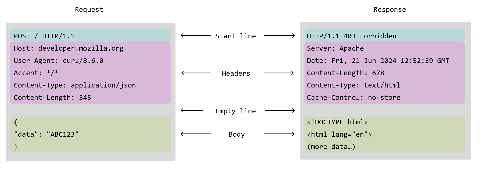

categories:

- Networking

tags:

- HTTP
- Apache
- Web

## description: Understanding the Host header in HTTP.

# Understanding HTTP Host Header

## What is Host?

The Host header identifies the destination virtual host.

Example:

```http
GET / HTTP/1.1
Host: example.com
```



## Why is it important?

Apache and Nginx use this header to select the correct virtual host.
